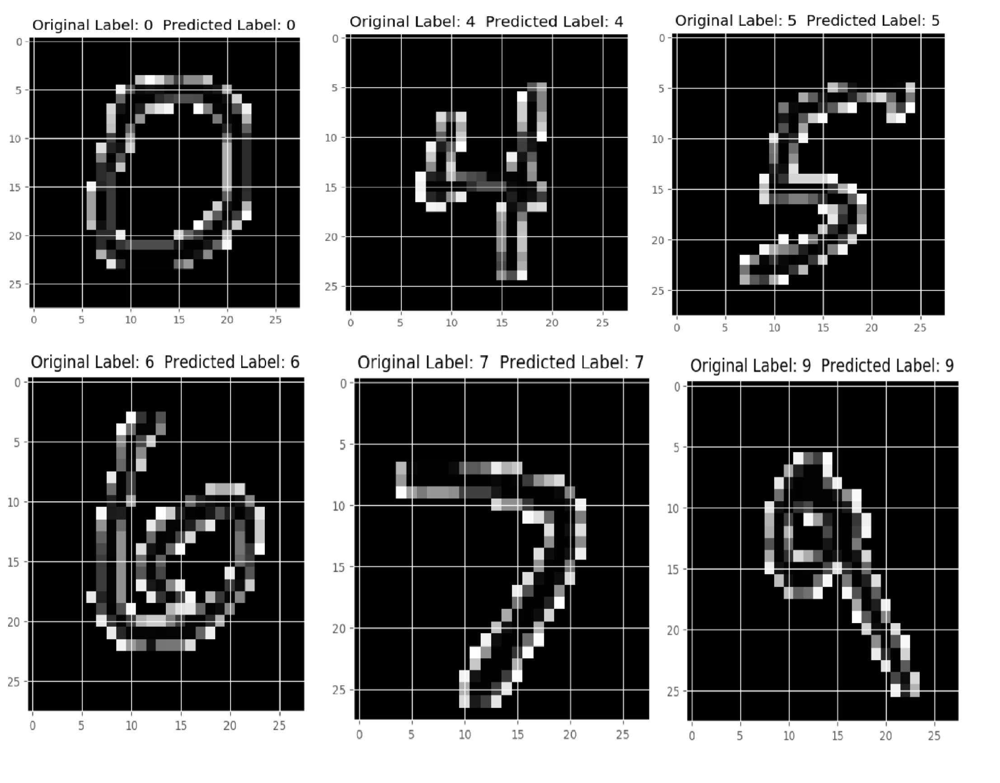

# Handwritten Digit Recognition using Machine Learning and Deep Learning

#### Note : Since, Git LFS on github.com does not currently support pushing LFS objects to public forks - Full pledged repository is moved to GitLab. Avalable On [Banee Ishaque K / Handwritten-Digit-Recognition-using-Deep-Learning](https://gitlab.com/baneeishaque/handwritten-digit-recognition-using-deep-learning). This repository is keep for tracking updates from upstream branch, anyway updates from all repositories will be synced as soon as possible.

[//]: <> "#### GitHub Repository : [Baneeishaque/Handwritten-Digit-Recognition-using-Deep-Learning](https://github.com/Baneeishaque/Handwritten-Digit-Recognition-using-Deep-Learning) : [](https://gitpod.io/#https://github.com/Baneeishaque/Handwritten-Digit-Recognition-using-Deep-Learning)  "

[//]: <> "#### GitLab Repository : [Banee Ishaque K / Handwritten-Digit-Recognition-using-Deep-Learning](https://gitlab.com/baneeishaque/handwritten-digit-recognition-using-deep-learning) : [](https://gitpod.io/#https://gitlab.com/baneeishaque/handwritten-digit-recognition-using-deep-learning)  "

[](https://gitpod.io/#https://gitlab.com/baneeishaque/handwritten-digit-recognition-using-deep-learning)
[](https://codebeat.co/projects/gitlab-com-baneeishaque-handwritten-digit-recognition-using-deep-learning-master)

[//]: <> "
"

## Published Paper 

[IJARCET-VOL-6-ISSUE-7-990-997](http://ijarcet.org/wp-content/uploads/IJARCET-VOL-6-ISSUE-7-990-997.pdf)

# Requirements

* Python 3.5 +
* Scikit-Learn (latest version)
* Numpy (+ mkl for Windows)
* Matplotlib

# Usage

**1.** Download the four MNIST dataset files from this link:

```
http://yann.lecun.com/exdb/mnist/
```

**2.** Unzip and place the files in the dataset folder inside the MNIST_Dataset_Loader folder under each ML Algorithm folder i.e :

```
KNN
|_ MNIST_Dataset_Loader
   |_ dataset
      |_ train-images-idx3-ubyte
      |_ train-labels-idx1-ubyte
      |_ t10k-images-idx3-ubyte
      |_ t10k-labels-idx1-ubyte
```

Do this for SVM and RFC folders and you should be good to go.

**3.** To run the code, navigate to one of the directories for which you want to run the code using command prompt:

```
cd 1. K Nearest Neighbors/
```

and then run the file "knn.py" as follows:

```
python knn.py
```

or 

```
python3 knn.py
```

This will run the code and all the print statements will be logged into the "summary.log" file.

**NOTE: If you want to see the output to print on the Command prompt, just comment out line 16, 17, 18, 106 and 107 and hence you will get all the prints on the screen.**

Alternatively, you can also use PyCharm to run the code and run the ".py" file in there.

Repeat the steps for SVM and RFC code.


## Accuracy using Machine Learning Algorithms:

i)	 K Nearest Neighbors: 96.67%

ii)	 SVM:	97.91%

iii) Random Forest Classifier:	96.82%


       
